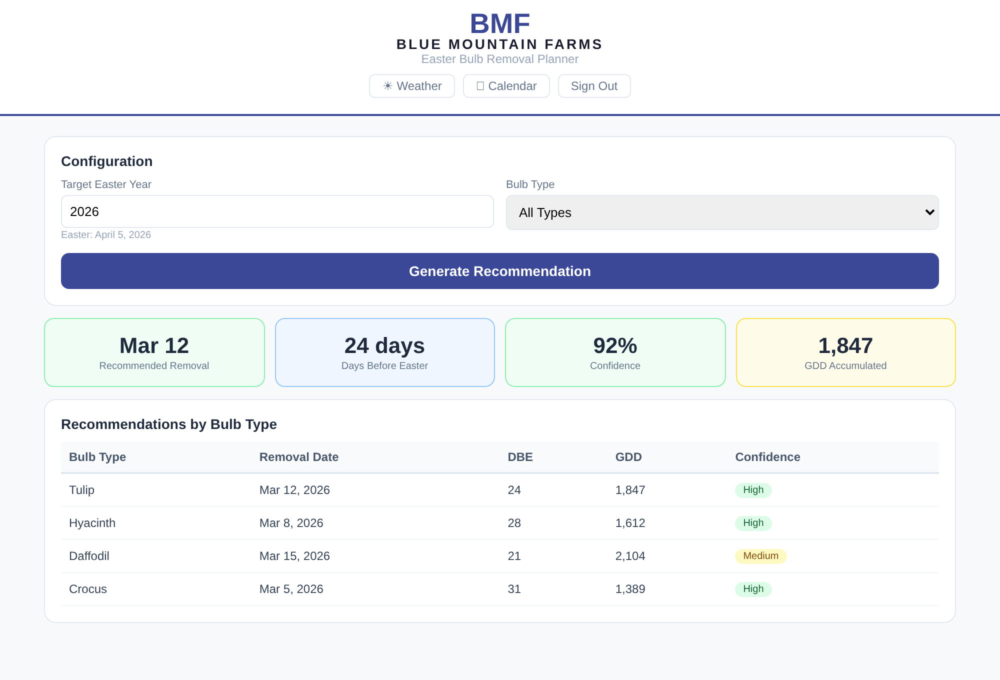

# Bulb Forecast AI

**Predicts optimal seasonal bulb removal timing using Growing Degree Day accumulation and Easter date regression — replacing guesswork with data-driven scheduling.**

Built for a 3rd-generation wholesale greenhouse operation that grows tulips, hyacinths, and other Easter bulbs. Removal timing directly impacts yield, labor efficiency, and whether product is ready for market on time.

<p align="center">
  
</p>

---

## The Problem

Seasonal bulb production is temperature-dependent and tied to a movable holiday (Easter). Traditional fixed-date scheduling leads to early or late cooler removal, inconsistent yields, and wasted labor. The difference between pulling bulbs 3 days early vs. 3 days late can mean the difference between full bloom on Easter Sunday or missing the market entirely.

## How It Works

The system ingests NOAA historical temperature data and historical removal records, then:

1. Computes **Growing Degree Day (GDD)** accumulation from daily temperatures
2. Engineers features around **Easter date offsets** (which shift year to year)
3. Runs **regression-based forecasting** to predict the optimal removal window
4. Outputs a **recommended removal date** with confidence metrics and KPIs

Users can upload historical records via Excel, select bulb types, configure ship-by targets, and export recommendations as CSV or JSON. Includes a built-in AI chat assistant for interpreting results.

## Tech Stack

React · TypeScript · Vite · Supabase (auth + database + edge functions) · Tailwind CSS · shadcn/ui

## Run Locally

```sh
npm install
npm run dev
```

Requires a Supabase project — see `.env.example` for required environment variables.

---

*Built by [Paige Miller](https://github.com/paige-millz)*
